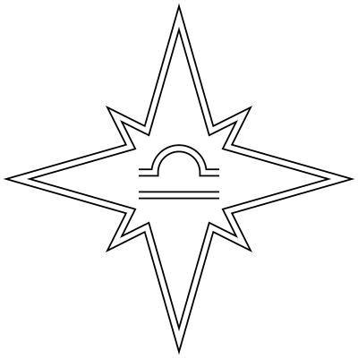

# astrea_py



Python bindings for [astrea](https://gitea.zarux.ru/astro/astrea), library for
statistical equilibrium calculations in plasma. Supports the following detailed
balance pairs: collisional bound-bound transitions, collisional
ionization-three-body recombination, radiative bound-bound transitions,
photoionization-radiative recombination-dielectronic recombination, charge
transfer ionization-recombination, and spontaneous emission.

## Installation

```sh
# Using pip
pip3 install git+https://gitea.zarux.ru/astro/astrea_py

# Using poetry
poetry add git+https://gitea.zarux.ru/astro/astrea_py
```

On linux also can be installed already compiled binaries:

```sh
# Using pip
pip3 install --index-url https://gitea.zarux.ru/api/packages/astro/pypi/simple astrea

# Using poetry
# Add source
poetry source add --priority=explicit astro https://gitea.zarux.ru/api/packages/astro/pypi/simple
# Install
poetry add --source=astro astrea
```

## Example

```python
import astrea as aa
import numpy as np


class KELT_9_b:
    def __init__(self):
        distance = 0.03
        self.F_lambda_vs_lambda = (
            aa.spectrum.kelt_9_fossati.F_lambda_vs_lambda()
        )
        self.F_lambda_vs_lambda[1] = (
            self.F_lambda_vs_lambda[1] / distance**2
        )


class O_I:
    def __init__(self):
        keys = [
            aa.element.o_i.STRUCTURE.LS_He_2s2_2p4_3P,
            aa.element.o_i.STRUCTURE.LS_He_2s2_2p3_4So_3s_5So,
        ]

        int_keys = np.array([k.value for k in keys])
        sort_indices = aa.element.o_i.E()[int_keys].argsort()
        sorted_keys = [int_keys[i] for i in sort_indices]

        self.keymap = {
            keys[sort_indices[i]]: i for i in range(len(sort_indices))
        }

        self.E = aa.element.o_i.E()[sorted_keys]
        self.g = aa.element.o_i.g()[sorted_keys]
        self.f = aa.element.o_i.f().T[sorted_keys].T[sorted_keys]
        self.C_vs_T = [
            [aa.element.o_i.C_vs_T()[i][j] for j in sorted_keys]
            for i in sorted_keys
        ]
        self.sigma_vs_nu = [
            aa.element.o_i.sigma_vs_nu()[i] for i in sorted_keys
        ]


class O_II:
    def __init__(self):
        keys = list(aa.element.o_ii.STRUCTURE.__members__.values())

        int_keys = np.array([k.value for k in keys])
        sort_indices = aa.element.o_ii.E()[int_keys].argsort()
        sorted_keys = [int_keys[i] for i in sort_indices]

        self.keymap = {
            keys[sort_indices[i]]: i for i in range(len(sort_indices))
        }

        self.E = aa.element.o_ii.E()[sorted_keys]
        self.g = aa.element.o_ii.g()[sorted_keys]
        self.f = np.zeros((1, 1))
        self.C_vs_T = [
            [
                np.zeros((2, 0)),
            ],
        ]
        self.sigma_vs_nu = [
            np.zeros((2, 0)),
        ]


class Env:
    def __init__(self, T, N_e, N_a, Delta_t=6e2):
        self.F_lambda_vs_lambda = KELT_9_b().F_lambda_vs_lambda

        elements = [
            O_I(),
            O_II(),
        ]
        self.E = [e.E for e in elements]
        self.g = [e.g for e in elements]
        self.f = [e.f for e in elements]
        self.C_vs_T = [e.C_vs_T for e in elements]
        self.sigma_vs_nu = [e.sigma_vs_nu for e in elements]

        self.T = T
        self.N_e = N_e
        self.N_a = N_a
        self.Delta_t = Delta_t

        self.cd = aa.transition.cd.R
        self.ce = aa.transition.ce.R
        self.rd = aa.transition.rd.R
        self.re = aa.transition.re_lorentz.R
        self.ri = aa.transition.ri.R
        self.rr = lambda ri: [
            [np.zeros_like(ri_x_z) for ri_x_z in ri_x] for ri_x in ri
        ]

        self.nlte = aa.population.balance_equation.n_t_plus_Delta_t
        self.lte = aa.population.boltzmann_distribution.n

        self.n = []

    def equilibrium(self):
        rd = self.rd(x=self.T, f=self.f, g=self.g, E=self.E)
        re = self.re(
            x=self.T,
            g=self.g,
            E=self.E,
            A=rd[x:=0],
            F_lambda_vs_lambda=self.F_lambda_vs_lambda,
        )
        ri = self.ri(
            x=self.T,
            sigma_vs_nu=self.sigma_vs_nu,
            F_lambda_vs_lambda=self.F_lambda_vs_lambda,
        )
        rr = self.rr(ri)
        ce = self.ce(T=self.T, N_e=self.N_e, C_vs_T=self.C_vs_T)
        cd = self.cd(T=self.T, R=ce, g=self.g, E=self.E)

        R_ij = [
            [re[i][j] + ce[i][j] for j in range(len(re[i]))]
            for i in range(len(re))
        ]
        R_ji = [
            [rd[j][i] + cd[j][i] for i in range(len(rd[j]))]
            for j in range(len(rd))
        ]
        R_ik = ri
        R_ki = rr

        lte = self.lte(T=self.T, g=self.g, E=self.E)
        nlte = self.nlte(
            x=self.T,
            n_t=lte,
            R_ij=R_ij,
            R_ji=R_ji,
            R_ik=R_ik,
            R_ki=R_ki,
            Delta_t=self.Delta_t,
        )

        self.n = [ # full population is taken from MHD
            [
                self.N_a[x][z] * nlte[x][z] / nlte[x][z].sum()
                for z in range(len(self.E))
            ]
            for x in range(len(self.T))
        ]


size = 100
T = np.geomspace(1e3, 1e4, size)
N_e = np.geomspace(1e7, 1e9, size)
N_a = np.ones((2, size)).T / 2
Delta_t = 6e10

env = Env(T=T, N_e=N_e, N_a=N_a, Delta_t=Delta_t)

env.equilibrium()

assert len(env.n) == size
```


## License

License: [GPL-3](./LICENSE)  
Author: Artem Shepelin (4.shepelin@gmail.com)